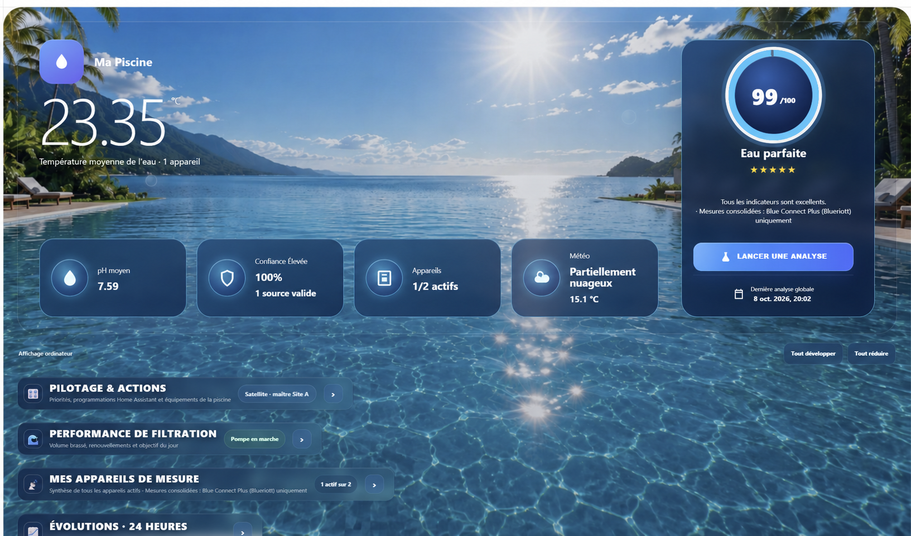
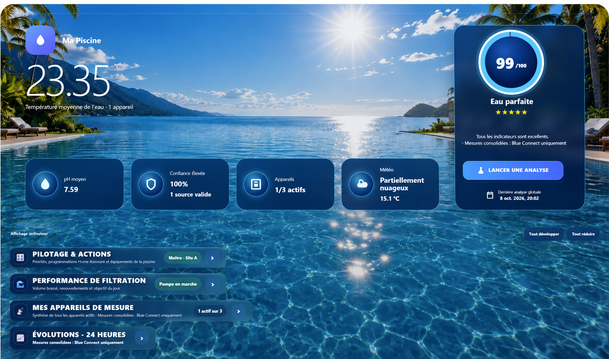
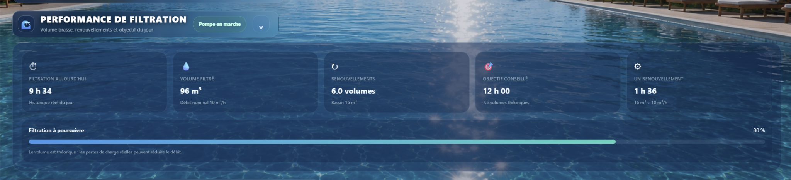
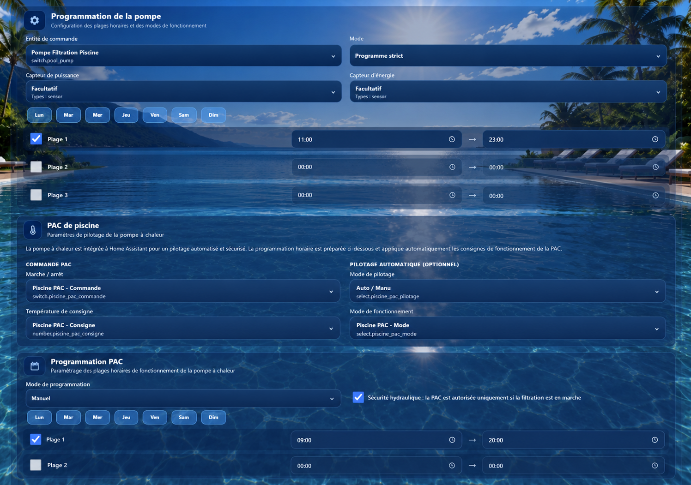
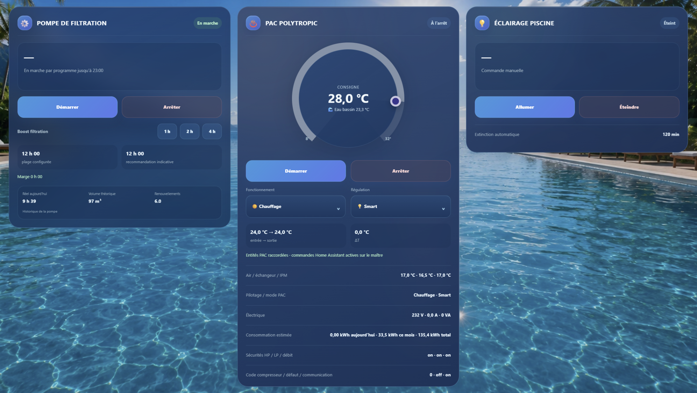
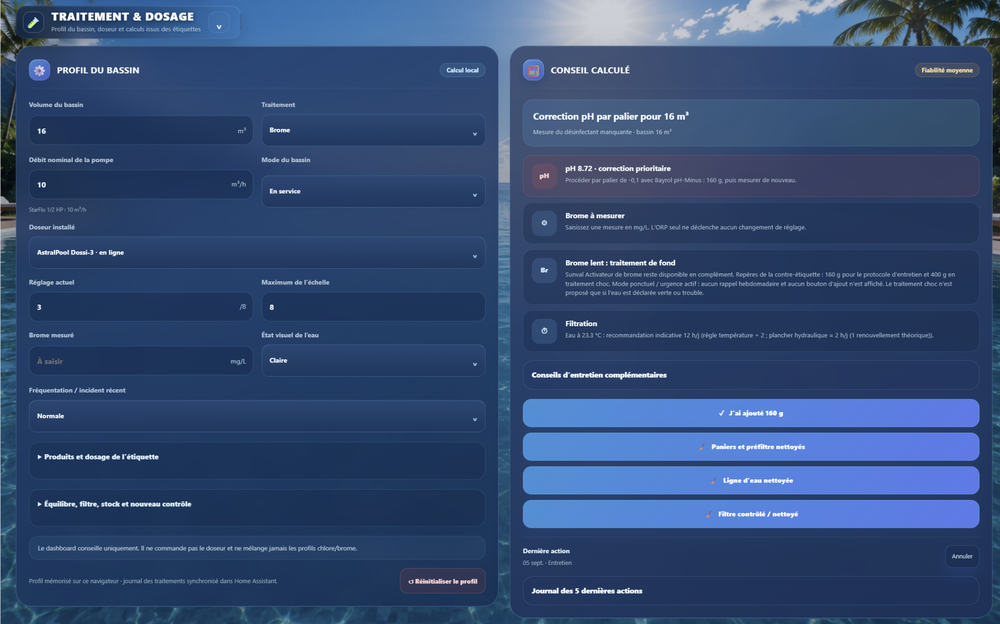

# Dashboard

Pool Cockpit brings the main pool measurements, filtration information, treatment tools and equipment status into a single Home Assistant dashboard.

The exact content depends on the devices and entities available in your Home Assistant installation.

## Overview

The dashboard is designed as a single responsive interface for desktop and mobile use.

Main areas include:

- pool analyzer measurements;
- filtration performance;
- scheduling;
- heat-pump information;
- treatment and dosage;
- historical information;
- contextual recommendations;
- optional expert explanation.

## Measurement devices

The **Mes appareils de mesure** section displays the compatible analyzers detected by Pool Cockpit.

Each device card can show information such as:

- water temperature;
- pH;
- ORP / redox;
- conductivity or another device-specific measurement;
- data freshness;
- measurement trend;
- source status;
- manual analysis status when supported.

Multiple compatible analyzers can be displayed on the same dashboard.

## Filtration performance

The **Performance de filtration** section summarizes the current filtration situation.

It can display:

- filtration duration for the current day;
- estimated filtered volume;
- number of pool-volume renewals;
- progress toward the daily filtration target;
- whether the displayed value comes from actual history or the planned schedule.

The displayed filtration recommendation is informational. Pool Cockpit keeps calculation and equipment execution separated.

## Scheduling

Pool Cockpit provides scheduling controls for supported equipment.

The interface can include:

- manual mode;
- strict programmed mode;
- recommended adaptive mode for the pump;
- one or more time ranges;
- seasonal reference profiles;
- astronomical-season guidance;
- temporary extensions;
- persistent manual override.

Seasonal profiles remain reference profiles: actual water temperature and operating context remain important inputs for recommendations.

## Heat pump

When configured, the heat-pump card displays information such as:

- operating state;
- target temperature;
- heating, automatic or cooling mode;
- regulation mode;
- inlet and outlet water temperature;
- communication state;
- reported fault information.

The current public version keeps heat-pump writes protected by a safety lock in the backend.

## Treatment and dosage

The **Traitement & dosage** section provides a local pool-treatment workspace.

Depending on configuration, it can include:

- pool volume;
- sanitizer type;
- pump nominal flow;
- pool operating mode;
- feeder model and setting;
- measured sanitizer level;
- water visual condition;
- recent bathing or pollution load;
- pH products;
- bromine or chlorine treatment information;
- optional supplemental products;
- TAC and hardness values;
- filter type and pressure;
- sanitizer stock;
- remeasurement delay;
- treatment journal.

Dosage information is calculated from the configured pool profile and product references. The user remains responsible for validating product labels and actual pool conditions before applying any treatment.

## Assistant Expert

The **Assistant Expert Piscine** is an explanatory layer.

It summarizes information already calculated by Pool Cockpit, including:

- scheduling priority;
- weather context;
- filtration status;
- treatment recommendation;
- heat-pump status.

The Assistant Expert does not replace Pool Cockpit's deterministic calculation rules and does not directly control pool equipment.

<!-- Screenshot: ../images/assistant-expert.png -->

## Multi-site coordination

Pool Cockpit can optionally coordinate two Home Assistant instances.

One instance can act as the master for scheduled execution while the second instance is used for display or permitted manual actions.

This feature is optional and is not required for a standard single-site installation.

## Responsive interface

The dashboard is designed to work on both desktop and mobile displays.

Sections can adapt their layout depending on screen size while preserving access to the same measurements and controls.
